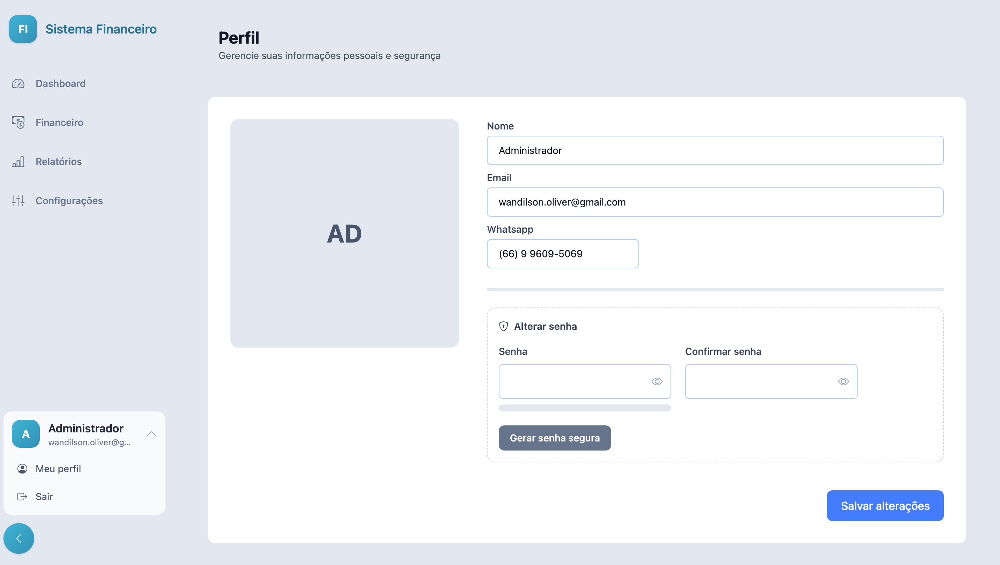

# 📊 Sistema de Dashboard

Sistema web moderno, responsivo e seguro, desenvolvido com foco em **autenticação avançada**, **experiência do usuário** e **boas práticas de segurança**.

---

## 🧱 Tecnologias Utilizadas

- **Laravel 12+**
- **Livewire 4**
- **Alpine.js**
- **Tailwind CSS 4**
- **PHP 8.3+**
- **MySQL / PostgreSQL**

---

## 📌 Visão Geral

O sistema consiste em um **Dashboard Web Responsivo**, com autenticação robusta, proteção contra tentativas indevidas de acesso, verificação em duas etapas via e-mail e gerenciamento completo do perfil do usuário.

---

## 🖥️ Interface & Experiência do Usuário

- Layout moderno e limpo
- Totalmente **responsivo** (desktop, tablet e mobile)
- Navegação intuitiva
- Feedback visual para ações do usuário
- Componentes reutilizáveis com Design System baseado em Tailwind

---

## 🔐 Autenticação & Segurança

### Login

- Autenticação via **e-mail e senha**
- Limite de **até 3 tentativas consecutivas de login**
- Bloqueio temporário após exceder o limite
- Proteção contra **ataques de força bruta**
- Opção **Remember Me**
  - Mantém o usuário autenticado com segurança
  - Token persistente com expiração configurável

---

### 🔑 Verificação em Duas Etapas (E-mail)

Após login bem-sucedido:

1. Geração automática de um **código de verificação único**
2. Envio do código para o **e-mail do usuário**
3. Validação obrigatória para concluir o login
4. Código:
   - Possui tempo de expiração
   - Uso único
   - Invalidado após confirmação

---

## 🔁 Recuperação de Senha

### Redefinição por Link de E-mail

- Fluxo seguro de redefinição de senha
- Link enviado para o e-mail cadastrado
- Token de redefinição:
  - Uso único
  - Tempo de expiração configurável
- Validação de força da nova senha

---

## 👤 Login

| Login | Verificação |
|------|-------------|
|  |  |

## 👤 Perfil do Usuário

### Edição de Dados Pessoais

O usuário pode editar:

- Nome
- E-mail
- Telefone / WhatsApp
- Foto de perfil (opcional)
- Outras informações básicas

---

### 🔐 Gerenciamento de Senha

- Alteração manual de senha
- **Geração automática de senha segura**
- Confirmação obrigatória da nova senha
- Opção de exibir/ocultar senha

---

### 💪 Validação de Força de Senha

A senha é validada automaticamente com base em:

- Comprimento mínimo
- Letras maiúsculas e minúsculas
- Números
- Caracteres especiais

Indicador visual de força:

- Fraca
- Média
- Forte

---

## ⚙️ Regras de Segurança

- Senhas armazenadas com **hash seguro**
- Tokens protegidos contra reutilização
- Sessões invalidadas em:
  - Logout manual
  - Alteração de senha
- Proteção contra CSRF
- Validação de dados no backend e frontend

---

## 📦 Funcionalidades Resumidas

| Funcionalidade                         | Status |
|---------------------------------------|--------|
| Login Seguro                          | ✅ |
| Limite de Tentativas de Login         | ✅ |
| Remember Me                           | ✅ |
| Verificação por Código via E-mail     | ✅ |
| Recuperação de Senha por E-mail       | ✅ |
| Dashboard Responsivo                  | ✅ |
| Edição de Perfil                      | ✅ |
| Geração Automática de Senha           | ✅ |
| Indicador de Força de Senha           | ✅ |

---

## 🧱 Arquitetura (Visão Geral)

- Backend baseado em **Laravel**
- Componentes reativos com **Livewire**
- Interações leves com **Alpine.js**
- Estilização com **Tailwind CSS**
- Separação clara entre:
  - Autenticação
  - Autorização
  - Perfil do Usuário

---

## 🚀 Possíveis Evoluções Futuras

- Autenticação multifator (TOTP / App Authenticator)
- Logs de atividades do usuário
- Gestão de permissões e papéis (Roles & Permissions)
- Notificações via SMS ou WhatsApp
- Internacionalização (i18n)

---

## 📄 Licença

Este projeto é de uso interno/privado.  
Distribuição ou comercialização depende de autorização do autor.

---
